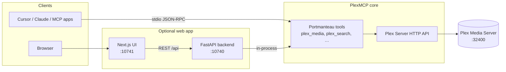

# Architecture

How PlexMCP is put together — useful before you self-host or extend the code.

---

## Big picture

---

## Three ways to run tools

| Mode | What runs | Typical use |
|------|-----------|-------------|
| **stdio MCP** | `uv run plex-mcp-advanced` — FastMCP app, tools call Plex over HTTP | Claude Desktop, Cursor, other MCP hosts |
| **HTTP MCP** | Same app exposed over HTTP (e.g. behind your ASGI entry) | Remote agents, custom gateways |
| **Web app backend** | FastAPI loads the same tool implementations in-process | Browser UI, REST, `/mcp` on the same port |

The **web app** is optional: you can use PlexMCP with **only** stdio and never start Next.js.

---

## Repository layout (conceptual)

| Area | Role |
|------|------|
| `src/plex_mcp/` | MCP server: tool modules, services (Plex, RAG ingest, etc.) |
| `webapp/backend/` | FastAPI: proxies to tools, settings, LLM, RAG HTTP |
| `webapp/frontend/` | Next.js: pages, components, calls `/api` on the backend |

---

## Data flow (web app)

1. Browser loads the Next.js app (default **10741**).
2. UI calls FastAPI (**10740**), e.g. `/api/search/`, `/api/libraries/`.
3. Backend uses an MCP-style client to invoke the **same** Python tool functions loaded from `plex_mcp`.
4. Tools use `plexapi` (and optional LanceDB) against **your** Plex URL.

Settings saved in the UI are written to `webapp/backend/data/settings.json` and merged into the process environment on startup — see [CONFIGURATION.md](CONFIGURATION.md).

---

## Optional RAG

Semantic features need shared vector helpers on `PYTHONPATH` (see [RAG.md](RAG.md)). Without that, keyword search and the rest of the server still work.

---

## Further reading

- [PLEX.md](PLEX.md) — Plex concepts and tokens  
- [SELF_HOSTING.md](SELF_HOSTING.md) — exposing the stack safely  
- [WEBAPP.md](WEBAPP.md) — ports and startup  
