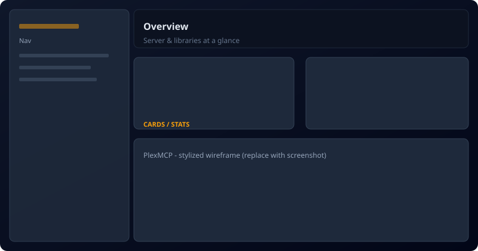
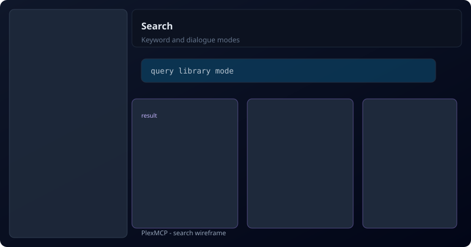
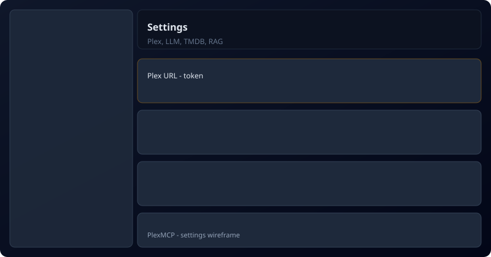

# Webapp

The **FastAPI** backend (port **10740**) loads PlexMCP tools in-process and exposes REST under `/api/*`. It mounts the same FastMCP app at **`/mcp`**. The **Next.js** frontend (port **10741**) is the browser UI.

See also [**ARCHITECTURE.md**](ARCHITECTURE.md), [**SELF_HOSTING.md**](SELF_HOSTING.md), and the [**documentation hub**](README.md).

## Documentation

- **[webapp/README.md](../webapp/README.md)** — stack, features, API overview  
- **[webapp/SETUP.md](../webapp/SETUP.md)** — environment and startup  

## Ports

Allocated in the fleet range per [mcp-central-docs WEBAPP_PORTS](https://github.com/sandraschi/mcp-central-docs/blob/main/docs/operations/WEBAPP_PORTS.md): **10740** backend, **10741** frontend.

## Quick start

```powershell
cd webapp
# Configure webapp\backend\.env (PLEX_TOKEN, PLEX_URL, optional LLM)
powershell -ExecutionPolicy Bypass -File .\start.ps1
```

Open `http://127.0.0.1:10741`. API docs: `http://127.0.0.1:10740/docs`.

## Screenshots (stylized wireframes)

Real pixels may differ as the UI evolves. These **SVG** previews document the main surfaces:

| Area | Preview |
|------|--------|
| **Overview** (dashboard / server) |  |
| **Search** (keyword or dialogue) |  |
| **Settings** (Plex, LLM, RAG) |  |

Replace with PNGs if you need marketing shots — see [assets/README.md](assets/README.md).

## *arr integration

Optional Radarr/Sonarr/Lidarr URLs and API keys in **Settings** power the Overview *arr card and the `arr_stack` MCP tool (read-only status + queue counts). Typical setups use Docker media stacks; use the base URL reachable from the backend.
